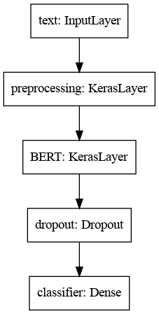

# IMDb-Sentiment-Analysis

## What

BERT (Bidirectional Encoder Representations from Transformers) computes vector-space representations of natural language that are suitable for use in deep learning models. It uses the Transformer encoder architecture to process each token of input text in the full context of all tokens **before** and **after**, hence bidirectional. BERT family of models are usually pre-trained on a large corpus of text, then fine-tuned for specific tasks.

## Why

Here I have used a variant of BERT (Small BERT) which has the same general architecture but fewer and/or smaller Transformer blocks, which lets us explore tradeoffs between speed, size and quality. I have also fine-tuned it to classify IMDb movie reviews (plain-text) into positive and negative classes based on the text of the review, thus performing sentiment analysis. The requirements to run the [notebook](Notebook.ipynb) can be found in the corresponding [file](requirements.txt) and can be installed with 
`pip3 install -r requirements.txt`

## How

I have used the [Large Movie Review Dataset](https://ai.stanford.edu/~amaas/data/sentiment) that contains the text of 50,000 movie reviews from IMDb. These are split into 25,000 reviews for training and 25,000 reviews for testing (both balanced). Thereafter I loaded the BERT encoder and corresponding Preprocessing model from TensorFlow Hub. Along with the Input, Dropout and Dense (acts as a classifier) layers, here is the final model:   
   
For fine-tuning, I used the same Adam optimizer as used in the original [BERT paper](https://arxiv.org/abs/1810.04805) along with the same scheduling strategy. Loss chosen was Binary Crossentropy. 

## Results

After 5 epochs of training (with initial warmup of learning rate for the first 10% steps followed by its linear decay), the model achieved a train accuracy of 93.7% and a test accuracy of 85.68% which is good enough considering the size of model and training time (~13 minutes).
